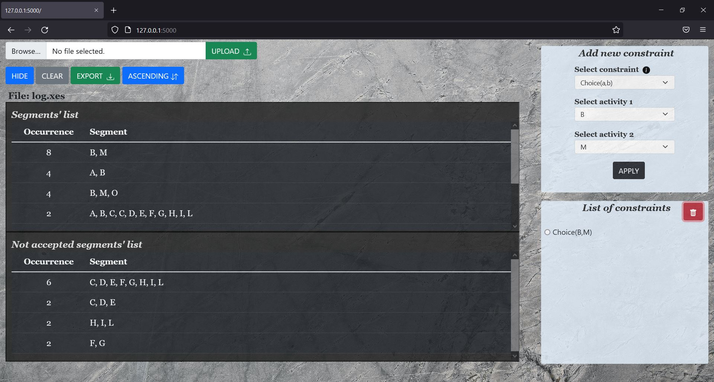
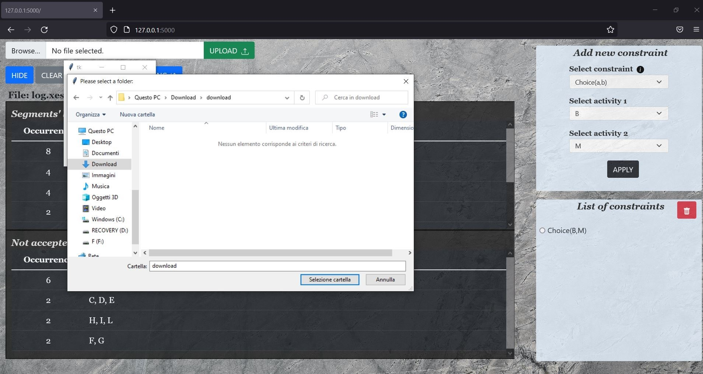

# SEC - SEgments Compliance

 ## Description
**SEgments Compliance** is a tool that helps users to identify all the potential behaviors (i.e., segments) of the routines of interest directly from an event log. 
It allows you to load the interested event log (in the *XES* format) and filter out those segments not allowed by any real-world routine behavior, by using the *DECLARE* constraints. Such constraints describe the temporally extended relations between the activities that must be satisfied throughout a segment (e.g., an activity a1 must be eventually followed by an activity a2). 
Finally, when you have identified and removed those segments that should not be compliant with any real-world routine behavior, you can export the resulting event log.

 ## Table of content
1. How to install
2. How to use

## How to install
For the installation of the tool you need:
1. Python (version 3.9): https://www.python.org/downloads/release/python-399/ (The installers are available at the bottom of the page)
2. Download the zip folder of the project: https://github.com/bpm-diag/SEC (press on *Code* and then on *Download ZIP*).

You can find a python installation guide here: https://python.land/installing-python.  
*N.B:* It is important that the version of python is the 3.9.

After installing everything, unzip the project and open the terminal of your computer and positioning within the project folder. 
So, inside the project folder type the following commands:
<code>pip install -r requirements.txt</code> 
<code>python main.py</code> 

If you are encountering errors in running the previous commands, run these lines: 

**For Windows:** 
<code>py -3 -m venv .venv</code> 
<code>.venv\scripts\activate</code> 
<code>pip install -r requirements.txt</code> 
<code>python main.py</code> 

**For Linux / macOS:** 
<code>python3 -m venv env</code> 
<code>source env/bin/activate</code> 
<code>pip install -r requirements.txt</code> 
<code>python main.py</code> 

At this point you can open your preferred browser between Firefox, Google Chrome, Microsoft Edge and Opera to view the tool.
Type in the url bar: 
<code>127.0.0.1:5000</code> 

**N.B.**: For a better experience it is suggested to use Firefox.

Now you are ready to use *SEC*!

## How to use
Select your **.xes** event log file from a folder of your choice via the *BROWSE* button, then continue with *UPLOAD*.

You can now view the segments in the *SEGMENTS' LIST* section on the left.  
You can use the *HIDE/SHOW* button to change the display of segments. If the button is set to *HIDE* by clicking on a row 
of the table you will be shown a pop-up that will show the content of the segment.

The segments are shown by default in ascending order following the number of occurrences. You can reverse the order by clicking on the button *ASCENDING/DESCENDING* and view them as you prefer.

On the right you can choose the *DECLARE* constraints you want to apply. 
Select the constraint and the activities to apply it to. If you do not remember the operation of a constraint click on 
*i* which shows an informative box.
All the constraints applied are visible in the *LIST OF CONSTRAINT* section and you can delete one at a time using 
the *TRASH* button.

Each time you apply a new constraint, segments that do not satisfy it are moved to the *NOT ACCEPTED SEGMENTS' LIST* section. 
 
 

If you are not satisfied with your work you can click on the *CLEAR* button and start again from the beginning by loading a new file.  
  
Otherwise, when you are satisfied with the results achieved, you can download the **.xes** file, by using the *EXPORT* button, 
and save it wherever you want.

 

Thus, the output of the tool consists in:
- a **.xes** event log file which stores the segments that satisfy the list of *DECLARE* constraints you chose;
- **log_timestamp.txt** file that is created every time you upload a *.xes* event log file within the tool. This file logs all the steps you have performed during your run, i.e.: each constraint you applied/deleted, the different buttons you clicked, etc...
These files are available inside the *timestamp* folder of the project.

For a video demonstration of the tool please refer to the following link: https://tinyurl.com/demo-tool

Sample log available for download: https://tinyurl.com/sample-log
